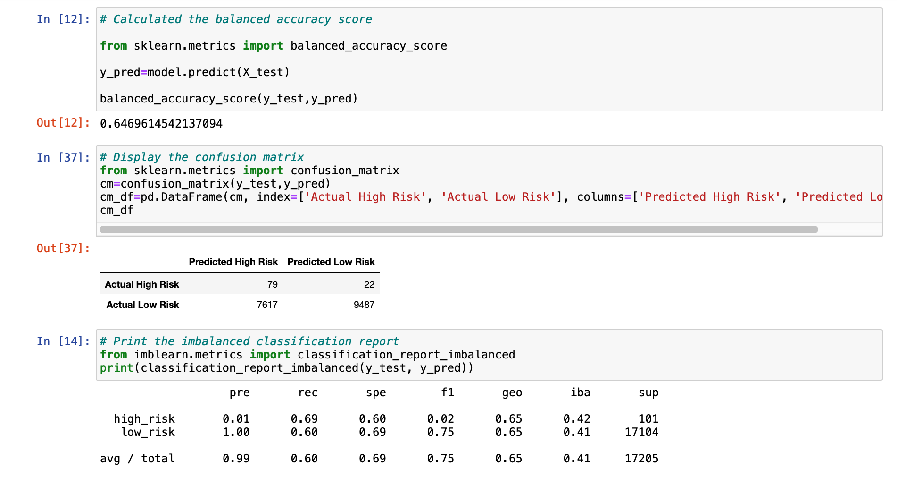
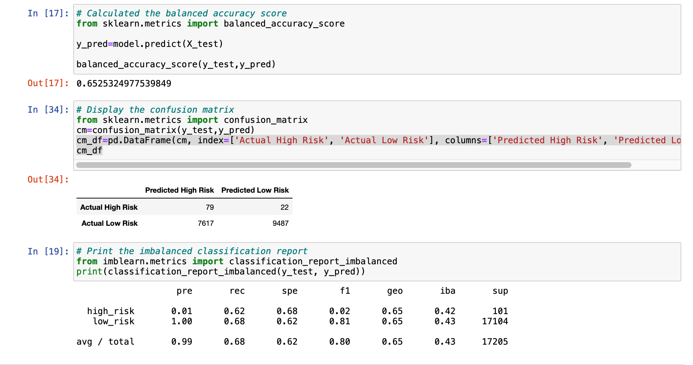
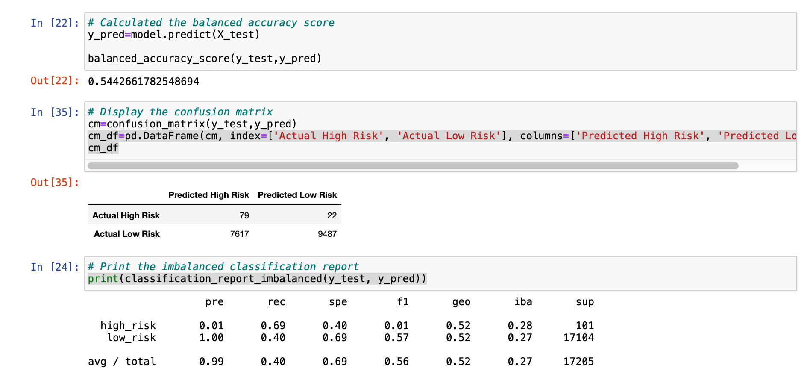

# Credit Risk Analysis Using Machine Learning
## Overivew of Analysis
* For this analysis I used my knowledge of Machine Learning to predict credit card risk.  
* I was given a dataset from Lending Tree.  With that I used the imbalanced-learn and scikit-learn libraries to build machine learning models and evaluate them using resampling
* I first oversampled the data using the SMOTE and RandomOverSampler algorithms
* Then undersampled the data using the ClusterCentroids algorithm
* Then used the SMOTEENN algorithm which is a combination of over and undersampling
* Finally I compared 2 models that reduce bias the (EasyEnsembleClassifier and BalancedRandomForestClassifier) to predict credit risk
## Results
* These are the results I found from each of the six machine learning models that I employed
  ### RandomOverSampler
   * **Balanced Accuracy Score:** 65%
   * **Precision Score:** 
     * 1% of actual high-risk loans were predicted high risk
     * 99% of actual low-risk loans were predicted low risk
    * **Recall:**
      * high-risk: 69%
      * low-risk: 60%
 
 ### SMOTE Oversampling
 * **Balanced Accuracy Score:** 65%
   * **Precision Score:** 
     * 1% of actual high-risk loans were predicted high risk
     * 99% of actual low-risk loans were predicted low risk
    * **Recall:**
      * high-risk: 62%
      * low-risk: 68%
 
 ### ClusterCentroids Undersampling
 * **Balanced Accuracy Score:** 54%
   * **Precision Score:** 
     * 1% of actual high-risk loans were predicted high risk
     * 99% of actual low-risk loans were predicted low risk
    * **Recall:**
      * high-risk: 69%
      * low-risk: 40%
 
  
